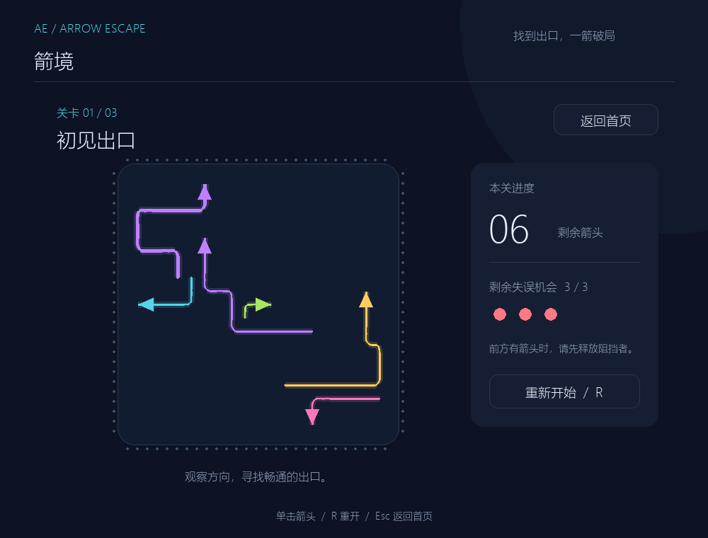
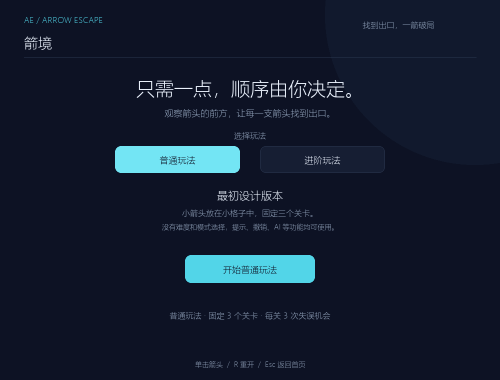
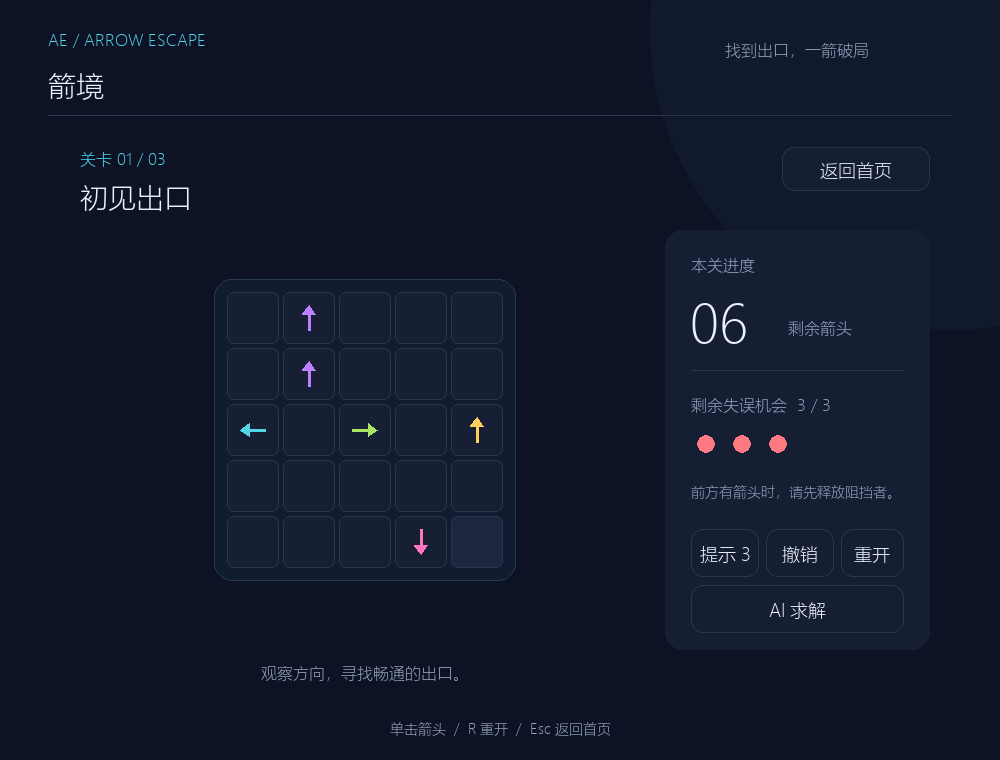
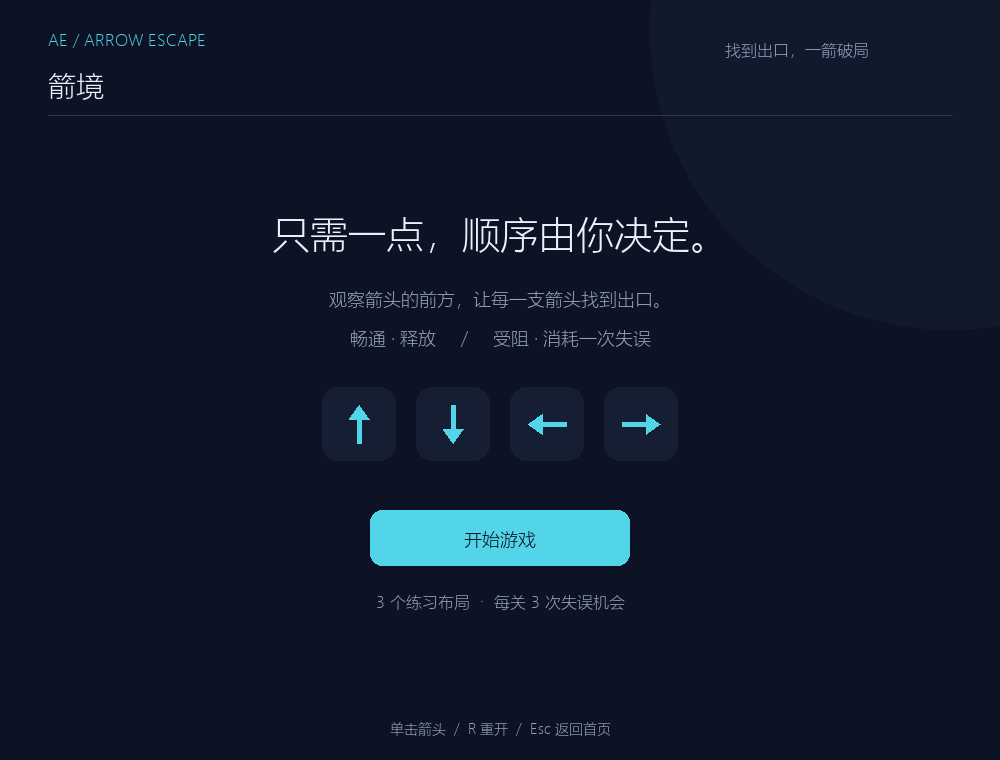
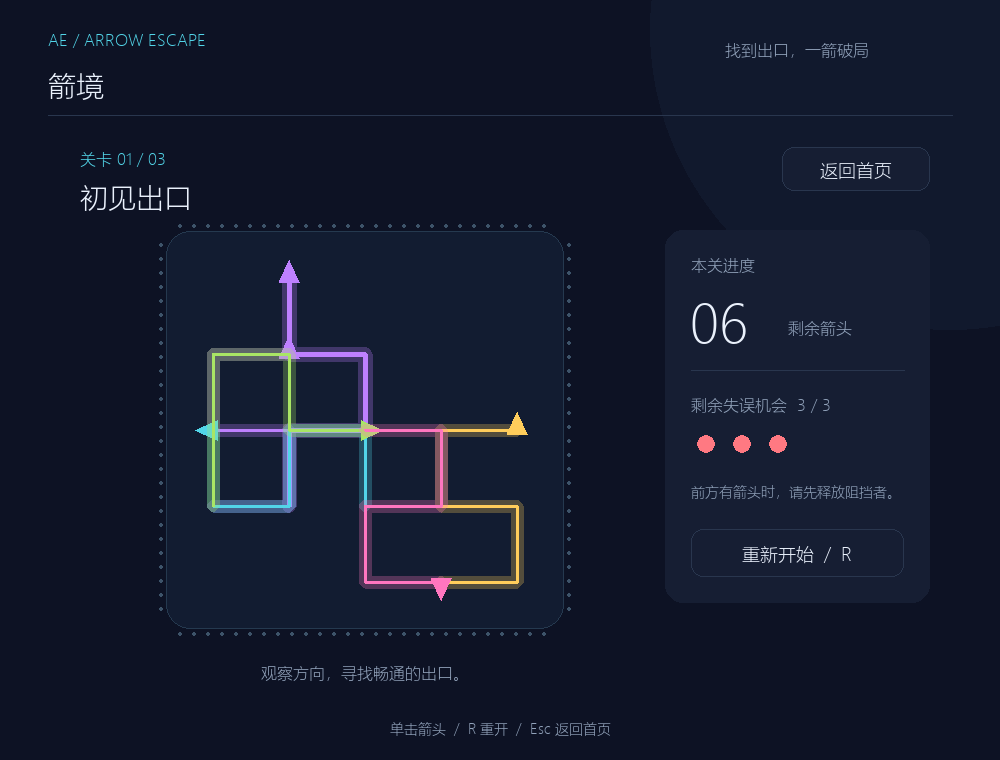
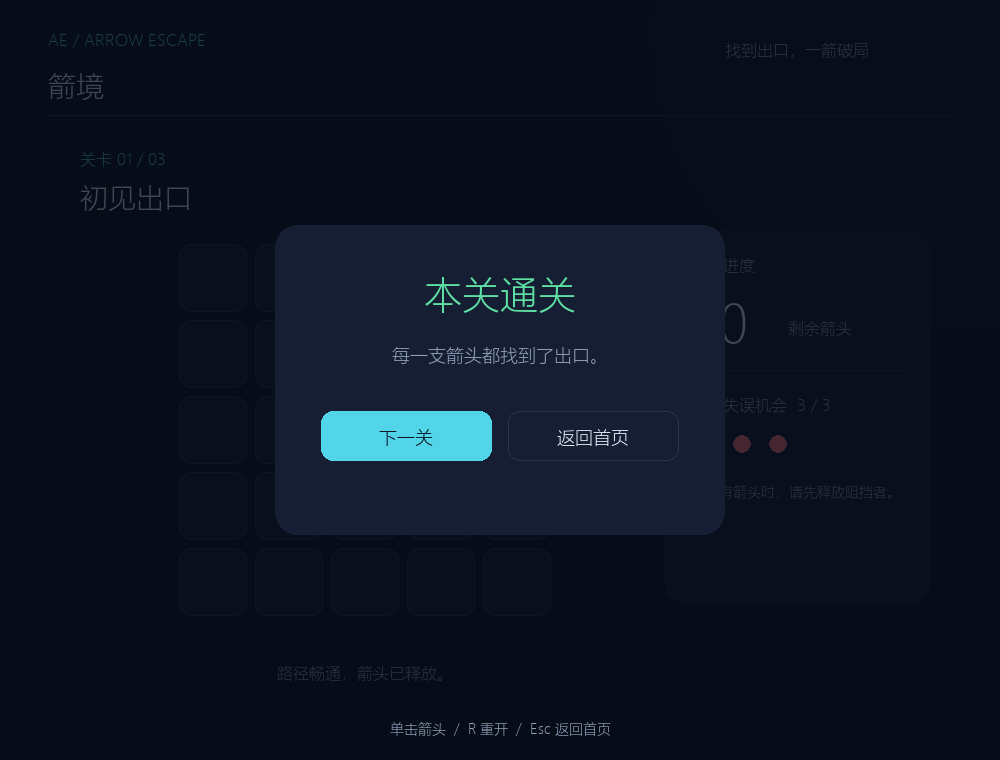
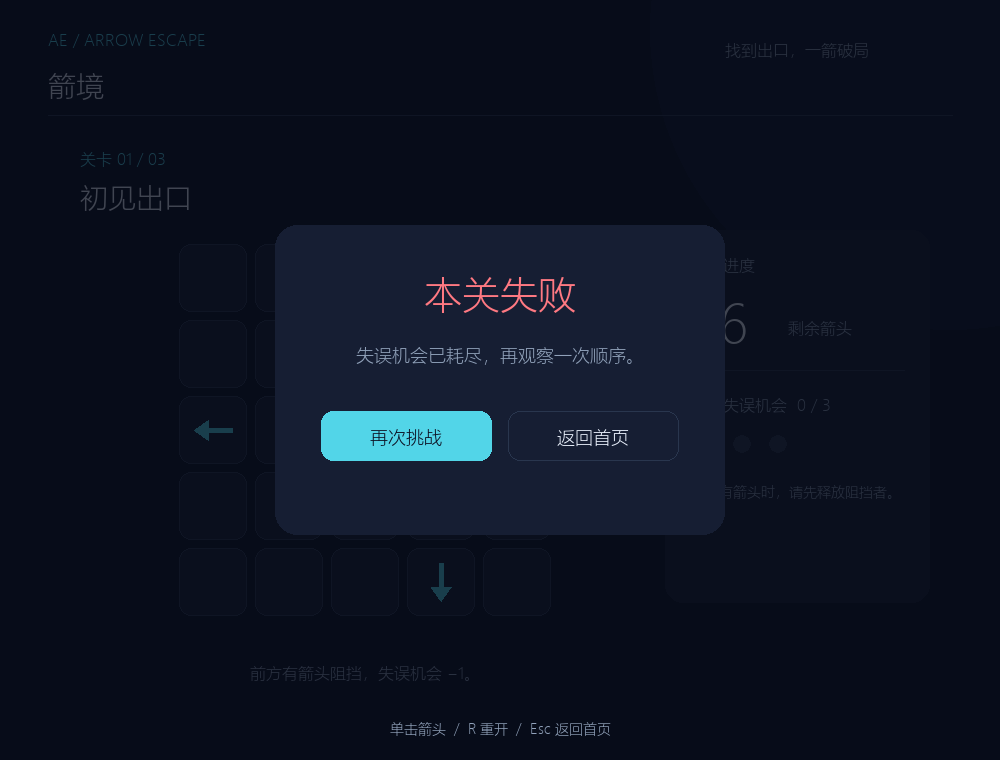

# Arrow Escape · 箭境

Python / Pygame 点击式箭头解谜游戏。沿箭头朝向到棋盘边界的路径没有其他箭头时，可以释放它；有阻挡则保留箭头并消耗一次失误。清空棋盘后进入通关页，失误耗尽后可以重开。

当前版本提供两种玩法：普通玩法是最初设计的固定三关版本，使用小箭头和小格子，不提供难度或模式选择；进阶玩法是当前主体，保留标准/无尽模式、难度选择、柔性尾线和完整的辅助功能。两种玩法都支持非阻塞飞出/碰撞动画、失误计数、重开、提示、撤销、AI 自动求解和关卡切换。

## 两种玩法

| 玩法 | 内容 |
| --- | --- |
| 普通玩法 | 最初设计版本；固定 3 个关卡；每个箭头独立放在小格子中；不显示难度和模式选择。 |
| 进阶玩法 | 当前版本主体；支持标准模式、简单/中等/困难难度，以及困难无尽模式；使用柔性尾线和路线地图视觉。 |

启动后先在主页选择玩法，再点击对应的开始按钮。普通玩法适合快速体验最初版本，进阶玩法适合持续挑战和无尽模式。



## 环境与运行

建议 Python 3.11+。本轮实际验证环境：Windows、Python 3.12.14、Pygame 2.6.1、pytest 9.1.1。中文界面优先匹配微软雅黑、黑体或 Noto Sans CJK；Windows 下回退到系统 `msyh.ttc`。其他平台请安装上述中文字体之一。

在项目根目录的 PowerShell 中，新环境执行：

```powershell
python -m venv .venv
.\.venv\Scripts\python.exe -m pip install -r requirements-dev.txt
.\.venv\Scripts\python.exe main.py
```

如果已使用本工作区准备好的虚拟环境，直接启动即可：

```powershell
.\.venv\Scripts\python.exe main.py
```

只运行游戏可安装 `requirements.txt`；`requirements-dev.txt` 额外包含 pytest。工作区系统 `python` 命令原先是不可用的 Windows 商店别名，已有 `.venv` 使用 Codex 随附解释器创建，无需激活环境。

## 打包 Windows 可执行文件

开发依赖包含 PyInstaller。在项目根目录执行：

```powershell
.\.venv\Scripts\python.exe -m PyInstaller --noconfirm --clean --onefile --windowed --name ArrowEscape main.py
```

打包完成后，可执行文件位于 `dist/ArrowEscape.exe`。

## 操作

- 在主页选择“普通玩法”或“进阶玩法”，点击对应的开始按钮进入第一关；鼠标左键点击箭头。
- 无阻挡：箭头头部加速飞出，柔性尾线逐段跟随，剩余箭头减少。离场约 450–1150 ms，按尾线长度调整，最后阶段淡出。
- 有阻挡：320 ms 红色回弹反馈，失误机会减一。动画期间同一箭头忽略重复点击，反馈结束后可再次点击。
- 每关三次失误机会；最后一次反馈结束后进入失败页。
- 每局有三次提示机会；点击“提示”会高亮一支当前可以合法离场的箭头，不会自动点击，提示次数跨关卡保留。
- 点击“撤销”可以撤销最近一次有效操作，恢复飞出的箭头或返还碰撞消耗的失误机会；重开关卡后撤销记录清空。
- 点击“AI 求解”会按正常飞行动画自动寻找并释放当前关卡的合法箭头，再次点击可停止自动求解。
- 首页先选择玩法：普通玩法固定为最初的三个关卡，不显示难度和模式选项；进阶玩法可选择标准模式或无尽模式，并可在标准模式下选择简单/中等/困难难度。
- 进阶玩法的无尽模式固定为困难难度，每次通关后随机生成下一关，并保证存在可通关顺序。
- 无尽模式会在每次通关后保存下一关编号；重新启动游戏并进入无尽模式时，会从已保存的关卡继续。
- “重新开始”或 `R` 恢复当前关原始布局、失误次数并清除动画。
- 最后一箭动画完成后显示通关页；点击“下一关”切关，末关显示全部练习完成。
- 一条尾线离场后再释放下一支，避免同一路径多条运动尾线叠在一起；离场期间仍可使用重开、返回和退出。
- `Esc` 返回首页；关闭窗口退出。

## 结构与核心算法

```text
main.py                程序入口
core/arrow.py          不可变箭头模型和四方向
core/path_checker.py   不修改状态的射线路径检测
core/board.py          棋盘占用数据
core/game.py           状态、点击结果和动画时间
core/progress.py       无尽模式本地进度读写
data/levels.py         三个原创 MVP 布局
ui/app.py              Pygame 绘制、按钮、鼠标命中和主循环
ui/rope.py             Verlet 节点、长度约束与轨迹引导
ui/rope_renderer.py    平滑曲线与抗锯齿箭头绘制
ui/routes.py           统一分配有间距的尾线路径
tests/                 路径、状态和界面事件测试
tools/smoke_ui.py      窗口自动验证与截图
tools/rope_demo.py     柔性跟随、转向和回弹独立示例
docs/                  测试记录、截图和真实 AIGC 记录
```

坐标使用 `(row, col)`，向下行号增加、向右列号增加。路径检测从箭头的下一格开始，沿方向步长检查同一行/列直到边界，只要遇到占用格就返回阻挡。后方和其他行列不参与检测；边缘向外的路径为空，直接畅通。复杂度为 O(前方格子数)，额外空间 O(1)。

模型的成功点击立即移除占用，绘制层通过动画副本展示离场，因此移除 blocker 后后续路径立即开放。核心 `Game.update(dt)` 推进动画，不调用 Pygame，也不休眠；窗口主循环持续处理事件、更新和绘制。绘制和命中使用同一 `BoardLayout` 几何换算。

柔性尾线由约 10 px 间距的连续节点组成，只固定最前端箭头节点。以 240 Hz 固定步长执行 Verlet 积分和 18 轮距离约束，近端先受牵引，远端依靠惯性和软轨迹约束渐进跟随。使用较强阻尼和距历史轨迹最多 4 px 的横向约束，保留轻微拉伸回弹，抑制大幅甩动。节点以 Catmull–Rom 曲线插值并 2 倍采样绘制后缩小，得到平滑连续尾线。

初始尾线统一规划，预留所有头部和直线离场走廊，并为不同尾线安排独立细网格路径；空间不足时缩短尾线。现有三关静止曲线间距均超过 15 px。视觉尾线不参与单格路径阻挡规则。游戏中的箭头仍按固定方向离场；转向响应可用独立示例查看：

```powershell
.\.venv\Scripts\python.exe -m tools.rope_demo
```


## 测试与开发证据

```powershell
.\.venv\Scripts\python.exe -m pytest -q
.\.venv\Scripts\python.exe -m compileall -q core data ui tools tests main.py
.\.venv\Scripts\python.exe -m tools.smoke_ui
.\.venv\Scripts\python.exe -m tools.smoke_ui --output docs/rope-evidence
```

pytest 的界面测试使用 SDL dummy 驱动；`tools.smoke_ui` 默认打开真实窗口，注入鼠标事件，完整清空三个布局，验证通关、失败、重开、切关和退出，将截图写到 `docs/screenshots/`。它是自动化验证，不能代替作业要求的本人实际试玩。详细结果与坐标顺序见 [M2 测试记录](docs/m2-verification.md)，AI 协作见 [AIGC 记录](docs/aigc-log.md)。

柔性尾线的最新验证与已知范围见 [柔性动画验证](docs/rope-verification.md)，当前回归测试共 94 项。

### 普通玩法




### 进阶玩法与结果页






## 资源与来源

游戏源码、练习布局、箭头和界面图形在本项目中编写，箭头由 Pygame 图元绘制；没有使用商业游戏代码、关卡、美术或音效，没有下载网络素材。字体使用本机系统字体，不分发字体文件。需求与 PRD 来自用户工作区；开发工作流参考用户提供的 `arrow_game_codex_skills`。
