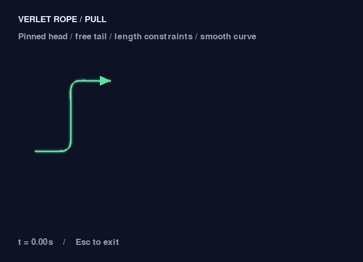

# 柔性尾线验证记录

2026-09-15。本次实现按用户“不是乱甩”和“线不要重叠在一起”的补充，采用受轨迹约束的逐段牵引：头部先飞出，尾线沿已有路径渐进跟随，保持小幅弹性偏离。开始时已存在地图尾线的未提交外观，沿用其边界和颜色，并替换整体平移动画。

## 实现

- `ui/rope.py`：约 10 px 间距的节点链，头部固定，尾部自由；240 Hz Verlet 积分，18 轮距离约束，阻尼 0.96；历史路径软引导，横向偏离最多 4 px，允许沿路径纵向滞后。
- `ui/routes.py`：统一预留头部、直线离场走廊和已分配路线，生成有间距的细网格尾线；空间有限时缩短。静止路线按关卡初始布局缓存，移除一箭不重新排布其他尾线。
- `ui/rope_renderer.py`：Catmull–Rom 连续曲线采样和 2 倍分辨率绘制后缩小；箭头尖端与头节点相连。物理更新仅在 `update()` 中执行，多次绘制不推进模拟。
- `ui/app.py`：飞出距离包含尾线长度，末箭结果页等待尾线结束；一条飞行尾线结束后才接受下一次箭头释放，避免运动线叠在同一离场通道。重开、返回、退出仍可用。
- `core/game.py`：可选视觉时长支持长尾离场；未接入 UI 的核心状态测试沿用原先基础时长。

尾线是视觉效果，规则仍用箭头所在单格判断阻挡。当前三关箭头按 UP/DOWN/LEFT/RIGHT 固定方向离场；平滑转向响应在独立演示中验证。

## 实际验证

```powershell
.\.venv\Scripts\python.exe -m pytest -q
# 68 passed in 4.36s
.\.venv\Scripts\python.exe -m tools.smoke_ui --output docs/rope-evidence
# SDL video driver: windows
# L1/L2/L3 -> SUCCESS
# UI smoke passed: home, hover, collision, flight, failure, restart, 3 levels, next, quit
.\.venv\Scripts\python.exe -m tools.rope_demo --frames-dir docs/rope-evidence/demo-frames
# 121 张 30 fps 帧，示例正常退出
.\.venv\Scripts\python.exe -m compileall -q core data ui tools tests main.py
# 退出码 0
```

GIF 使用已捕获的帧在本机随附 Pillow 中合成；Pillow 不是游戏运行依赖。原始帧目录不纳入 Git。默认窗口测试会覆盖 `docs/screenshots`，本轮指定新目录，保留原有截图。

| 核心验收 | 实际证据 |
| --- | --- |
| 头部运动，尾部不整体平移 | 快速牵引时头部前移 10 px，远端前移小于 3 px，近端响应大于远端；测试通过 |
| 转向形成连续曲线 | 先横移再下移，内部节点明显偏离头尾直线；连续切线测试及转向示例通过 |
| 可控拉伸与小幅回弹 | 距离约束测试误差低于 8%；停止后有短暂响应并衰减；轨迹横向偏离测试不超过 4 px |
| 不出现静止路线重叠 | 三关所有路线对的平滑曲线间距测试均大于 15 px；查看截图确认分离 |
| 多次点击不叠加运动线 | 第二次释放等前一尾线离场，测试验证无扣失误、无叠加模拟 |
| 帧率无关 | 30 fps 与 144 fps 各推进 1 s，节点坐标一致，测试通过 |
| 绘制不推进物理 | 重复 `draw()` 后节点坐标不变，测试通过 |
| 重开/末箭状态正确 | 重开立即清除尾线模拟；末箭视觉时长完成前仍为游戏中，结束后成功；测试通过 |
| 整体流程 | Windows 真实窗口注入事件完成三关、失败、重开、切关和退出 |

已检查初始布局、飞出、碰撞与示例的牵引/转向/回弹帧。窗口事件和捕获均是自动化验证，不冒充本人实际试玩。历史 M2 测试文档反映当时版本，本文记录新效果。

## 本地运行

游戏：

```powershell
.\.venv\Scripts\python.exe main.py
```

独立平滑转向演示（循环播放，Esc 退出）：

```powershell
.\.venv\Scripts\python.exe -m tools.rope_demo
```


